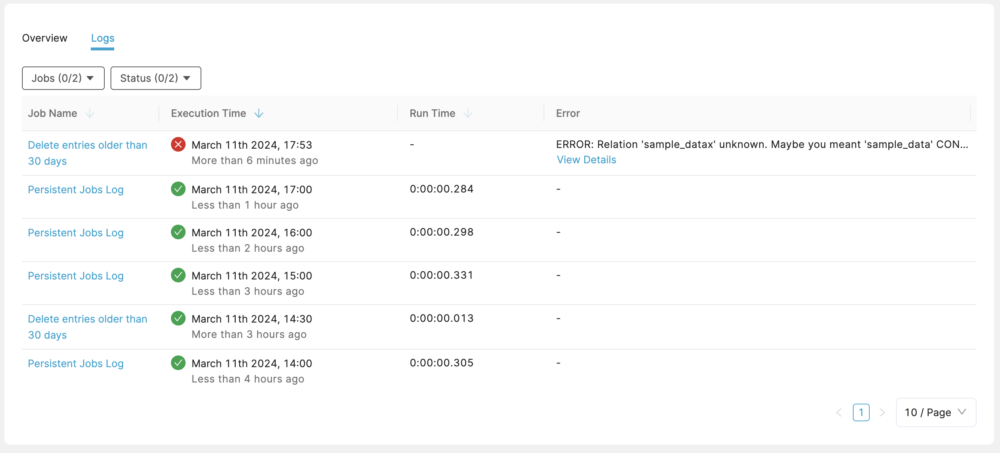
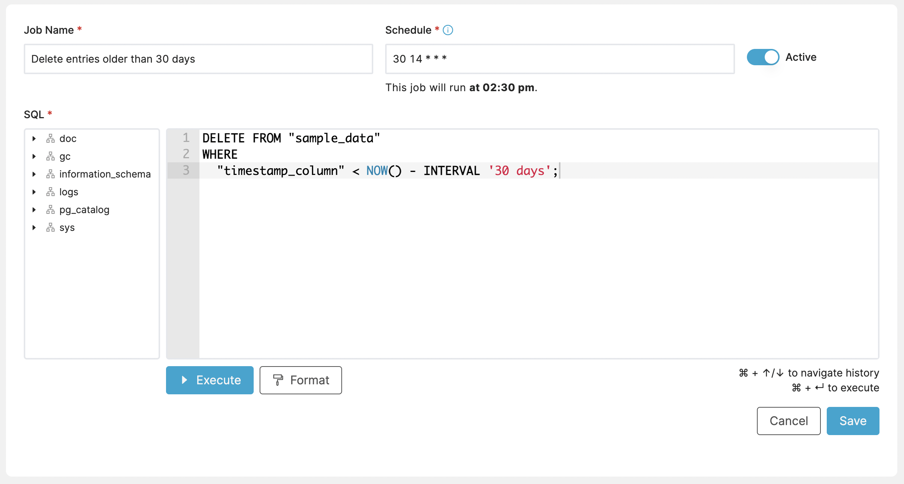
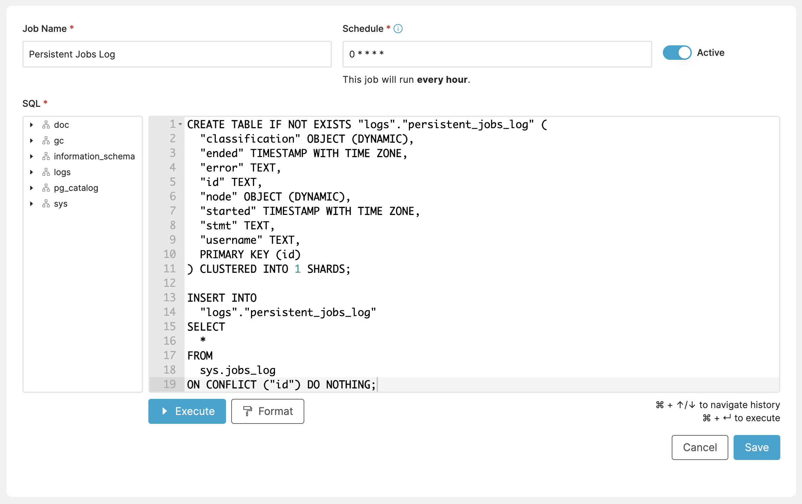
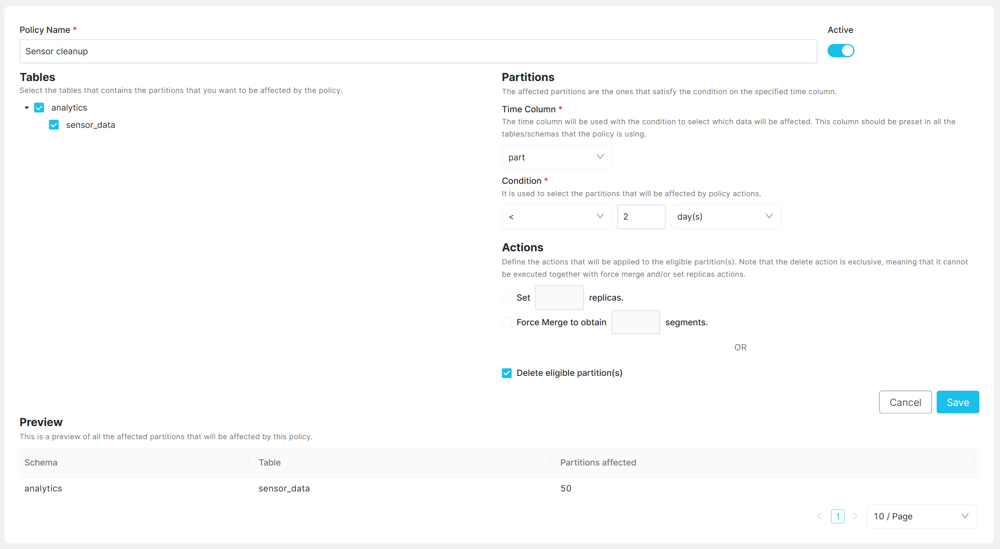

(cluster-automation)=
# Automation

Automation in CrateDB Cloud allows users to streamline and manage routine
database operations efficiently. Two primary automation features available are
the SQL Scheduler and Table Policies, both of which facilitate the maintenance
and optimization of database tasks.

:::{important}
- Automation is available for all newly deployed clusters.
- For existing clusters, the feature can be enabled on demand. (Contact
  [support](https://support.crate.io/) for activation.)

Automation utilizes a dedicated database user `gc_admin` with full cluster
privileges to execute scheduled tasks and persists data in the `gc` schema.
:::

## SQL Scheduler

The SQL Scheduler is designed to automate routine database tasks by scheduling
SQL queries to run at specific times, in UTC time. This feature supports
creating job descriptions with valid [cron patterns](https://www.ibm.com/docs/en/db2oc?topic=task-unix-cron-format)
and SQL statements, enabling a wide range of tasks. Users can manage these jobs
through the Cloud UI, adding, removing, editing, activating, and deactivating
them as needed.

### Use Cases

- Regularly updating or aggregating table data.
- Automating export and import of data.
- Deleting old/redundant data to maintain database efficiency.

### Accessing and Using the SQL Scheduler

SQL Scheduler can be found in the "Automation" tab in the left-hand
navigation menu. There are two tabs relevant to the SQL Scheduler:


**SQL Scheduler** shows a list of your existing jobs. In the list, you can
activate/deactivate each job with a toggle in the "Active" column. You can
also edit and delete jobs with buttons on the right side of the list.
  


**Logs** shows a list of *scheduled* job runs, whether they failed or succeeded,
execution time, run time, and the error in case they were unsuccessful. In case
of an error, more details can be viewed showing the executed query and a stack
trace. You can filter the logs by status or by a specific job.



### Examples

#### Cleanup of Old Files

Cleanup tasks represent a common use case for these types of automated jobs.
This example deletes records older than 30 days from a specified table once a
day:

```sql
DELETE FROM "sample_data"
WHERE
  "timestamp_column" < NOW() - INTERVAL '30 days';
```

How often you run it, of course, depends on you, but once a day is common for
cleanup. This expression runs every day at 2:30 PM UTC:

Schedule: `30 14 * * *`
  


#### Copying Logs into a Persistent Table

Another useful example might be copying data to another table for archival
purposes. This specifically copies from the system logs table into one of
our own tables.

```sql
CREATE TABLE IF NOT EXISTS "logs"."persistent_jobs_log" (
  "classification" OBJECT (DYNAMIC),
  "ended" TIMESTAMP WITH TIME ZONE,
  "error" TEXT,
  "id" TEXT,
  "node" OBJECT (DYNAMIC),
  "started" TIMESTAMP WITH TIME ZONE,
  "stmt" TEXT,
  "username" TEXT,
  PRIMARY KEY (id)
) CLUSTERED INTO 1 SHARDS;

INSERT INTO
  "logs"."persistent_jobs_log"
SELECT
  *
FROM
  sys.jobs_log
ON CONFLICT ("id") DO NOTHING;
```

In this example, we schedule the job to run every hour:

Schedule: `0 * * * *`



:::{note}
Limitations and Known Issues:
* Only one job can run at a time; subsequent jobs will be queued until the
  current one completes.
* Long-running jobs may block the execution of queued jobs, leading to
  potential delays.
:::


## Table Policies

Table policies allow automating maintenance operations for **partitioned tables**.
Automated actions can be set up to be executed daily based on a pre-configured
ruleset.


### Overview

Table policy overview can be found in the left-hand navigation menu under
"Automation". From the list of policies, you can create, delete, edit, or
(de)activate them. Logs of executed policies can be found in the "Logs" tab.


A new policy can be created with the "Add New Policy" button.



After naming the policy and selecting the tables/schemas to be impacted, you
must specify the time column. This column, which should be a timestamp used for
partitioning, will determine the data affected by the policy. It is important
that this time column is consistently present across all targeted tables/schemas.
While you can apply the policy to tables without the specified time column,
it will not get executed for those. If your tables have different timestamp
columns, consider setting up separate policies for each to ensure accuracy.

:::{note}
The "Time Column" must be of type `TIMESTAMP`.
:::

Next, a condition is used to determine affected partitions. The system is
time-based. A partition is eligible for action if the value in the partitioned
column is smaller (`<`), or smaller or equal (`<=`) than the current date minus
`n` days, months, or years.

### Actions

Following actions are supported:
* **Delete:** Deletes eligible partitions along with their data.
* **Set replicas:** Changes the replication factor of eligible partitions.
* **Force merge:** Merges segments on eligible partitions to ensure a specified number.

After filling out the info, you can see the affected schemas/tables and the
number of affected partitions if the policy gets executed at this very moment.

### Examples

Consider a scenario where you have a table and want to optimize space on your
cluster. For older data (e.g., 30 days), which may have already been snapshotted
and is only accessed infrequently, meaning it's not used for live analyitcs, it
might be sufficient for it to exist just once in the cluster without replication.
Additionally, you may not want to retain data older than 60 days.

Assume the following table schema:

```sql
CREATE TABLE data_table (
   ts TIMESTAMP,
   ts_day GENERATED ALWAYS AS date_trunc('day',ts),
   val DOUBLE
) PARTITIONED BY (ts_day);
```

For the outlined scenario, the policies would be as follows:

**Policy 1 - Saving replica space:**
* **Time Column:** `ts_day`
* **Condition:** `older than 30 days`
* **Actions:** `Set replicas to 0.`

**Policy 2 - Data removal:**
* **Time Column:** `ts_day`
* **Condition:** `older than 60 days`
* **Actions:** `Delete eligible partition(s)`
