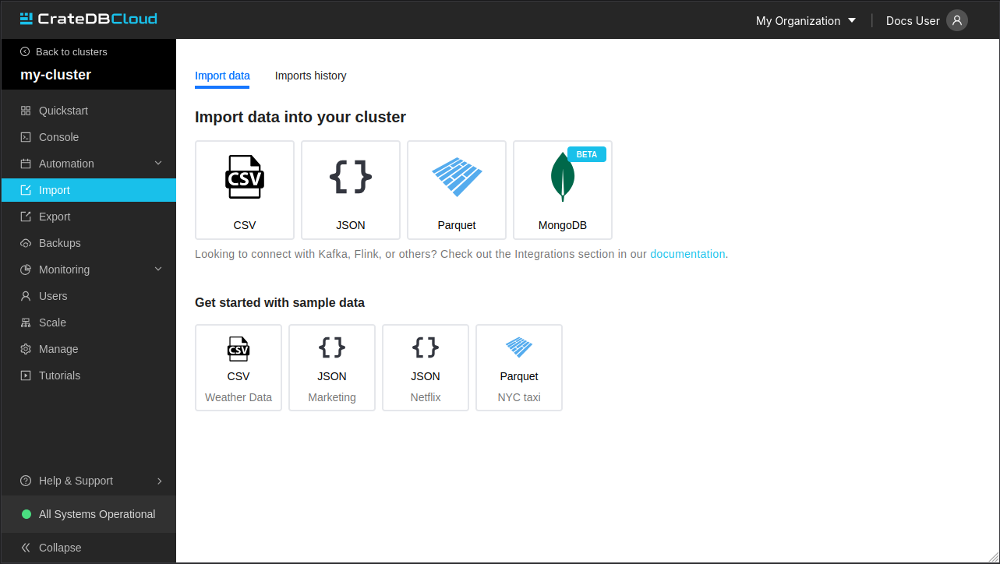
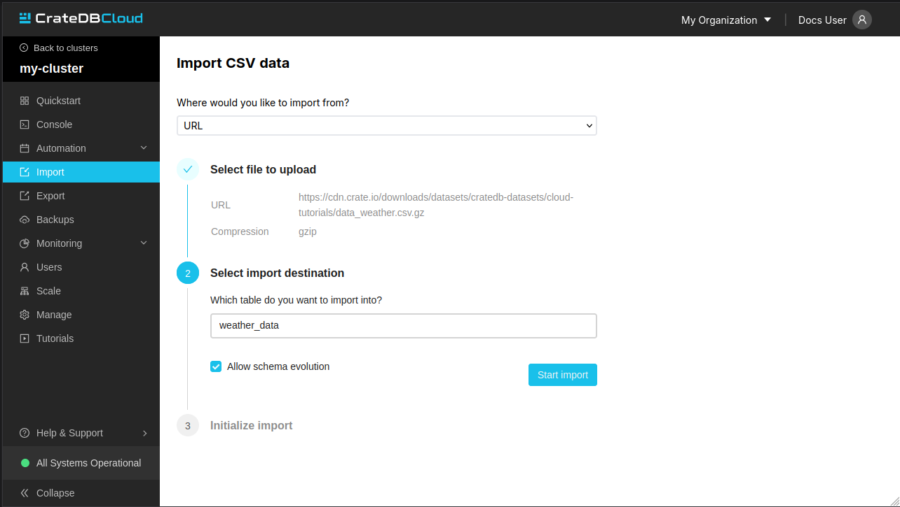

(cluster-import)=
# Import 

You can import data into your CrateDB directly from sources like:
- local file
- URL
- AWS S3 bucket
- Azure storage
- MongoDB

The data you will import can be in one of those format:
- CSV
- JSON (JSON-Lines, JSON Arrays and JSON Documents)
- Parquet
- MongoDB collection

:::{note}
If you don't have a dataset prepared, we also provide sample data to let 
you discover CrateDB. After importing those examples, feel free to go to 
the tutorial page to learn how to use them.
:::

You can access the history of previous imports by clicking on 
"Import history" tab.
By navigating to "View detail", you can display details of a particular
import job (e.g. The number of successful and failed records per file).



(cluster-import-file-import)=
## File Import

To import data, select the file format, the source and the name of the table 
which will be created and populated with your data.

You can deactivate the "Allow schema evolution" checkbox if you don't want 
the destination table to be automatically created or its schema to be modified.

The following data formats are supported:

-   CSV (all variants)
-   JSON (JSON-Lines, JSON Arrays and JSON Documents)
-   Parquet

Gzip compressed files are also supported.



(cluster-import-file-import-s3)=
### AWS S3 bucket

CrateDB Cloud allows convenient imports directly from S3-compatible
storage. To import a file from a bucket, provide the name of your bucket,
and path to the file. The S3 Access Key ID, and S3 Secret Access Key are
also needed. You can also specify the endpoint for non-AWS S3 buckets.
Keep in mind that you may be charged for egress traffic, depending on
your provider. There is also a volume limit of 10 GiB per file for S3
imports.

Importing multiple files is also supported by using wildcard 
notation: `/folder/*.parquet`.

:::{note}
It is important to make sure that you have the right permissions to
access objects in the specified bucket. For AWS S3, your user should
have a policy that allows GetObject access, for example:

```json
{
  "Version": "2012-10-17",
  "Statement": [
    {
      "Sid": "AllowGetObject",
      "Effect": "Allow",
      "Principal": {
        "AWS": "*"
      },
      "Action": "s3:GetObject",
      "Resource": "arn:aws:s3:::EXAMPLE-BUCKET-NAME/*"
    }
  ]
}
```
:::

(cluster-import-file-import-azure)=
### Azure Blob Storage

Importing data from private Azure Blob Storage containers is possible
using a stored secret, which includes a secret name and either an Azure
Storage Connection string or an Azure SAS Token URL. An admin user at
the organization level can add this secret.

You can specify a secret, a container, a table and a path in the form
`/folder/my_file.parquet`.

Importing multiple files is also supported by using wildcard 
notation: `/folder/*.parquet`.

File size limitation for imports is 10 GiB per file.

(cluster-import-integration)=
## Integration

{ref}`More info about data integration. <cluster-integrations>`


(overview-cluster-import-schema-evolution)=
## Schema evolution 

Schema Evolution, available for all import types, enables automatic
addition of new columns to existing tables during data import,
eliminating the need to pre-define table schemas. This feature is
applicable to both pre-existing tables and those created during the
import process. It can be toggled via the 'Allow schema evolution' checkbox
on the import page.

Note that Schema Evolution is limited to adding new columns; it does not
modify existing ones. For instance, if an existing table has an
'OrderID' column of type **INTEGER**, and an import is
attempted with Schema Evolution enabled for data where 'OrderID'
column is of type **STRING**, the import job will fail due to
type mismatch.


## File Format Limitations 

**CSV** files:

1.  Comma, tab and pipe delimiters are supported.

**JSON** files:

The following formats are supported for JSON:

1.  JSON Documents. Will insert as a single row in the table.

    :::{code} console
    {
      "id":1,
      "text": "example"
    }
    :::

2.  JSON Arrays. Will insert as a row per array item.

    :::{code} console
    [
      {
        "id":1,
        "text": "example"
      },
      {
        "id":2,
        "text": "example2"
      }
    ]
    :::

3.  JSON-Lines. Each line will insert as a row.

    :::{code} console
    {"id":1, "text": "example"}
    {"id":2, "text": "example2"}
    :::
