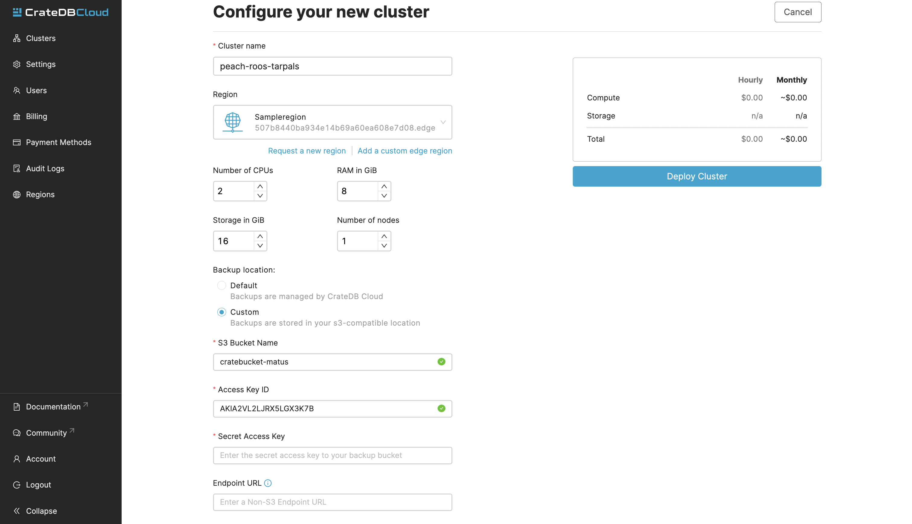

(edge-custom-backup)=
# Custom backup location

This guide introduces a feature of CrateDB Cloud on Kubernetes that lets
users specify their backup location. This gives you full ownership and 
control of your data when using CrateDB Cloud on Kubernetes.

(edge-custom-backup-prereqs)=
## Prerequisites

*   This guide describes only the final deployment stage of the CrateDB
    Cloud on Kubernetes cluster. For the full instructions, see either the
    {ref}`Self-hosted Edge <edge-self-hosted>`, or the
    {ref}`Managed Edge <edge-providers>` tutorials.
*   The custom backup location only supports [Amazon S3
    bucket](https://aws.amazon.com/s3/) or S3-compatible storage.

(edge-custom-backup-config)=
## Configuration

If you're using an Amazon S3 bucket, you will need the Access Key ID
and the Secret Access Key of the user that has access to the bucket that
you want to backup your data to.

If you're using non-Amazon S3 storage, you will also need to specify an
endpoint URL of the storage.

After you have put in your details, you can deploy the cluster.

Your cluster will now automatically backup to your storage every hour.
You can also make a manual backup with [COPY TO
statement](https://crate.io/docs/crate/reference/en/5.0/sql/statements/copy-to.html).

:::{note}
If you plan to do manual backups of certain files often, we encourage
you to enable the bucket versioning. That way, you can access older
revisions of the saved files.
:::
