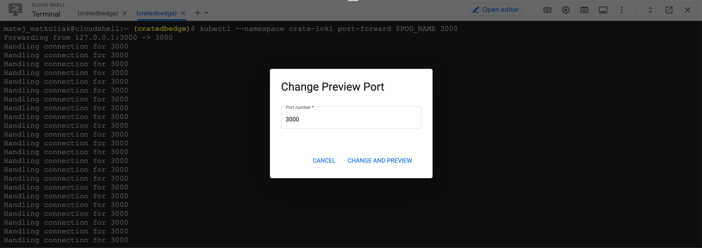
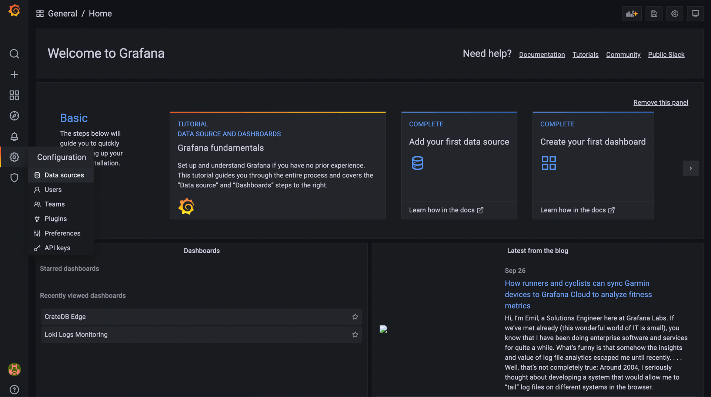
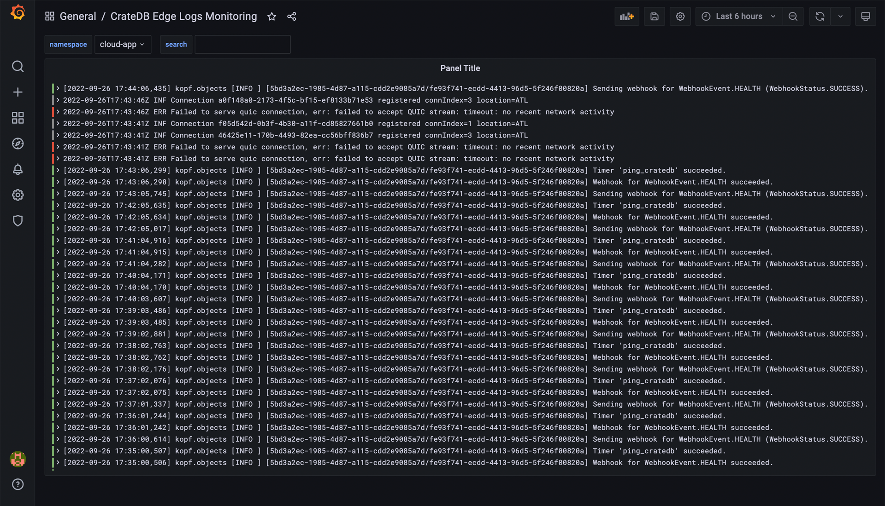

(edge-monitoring)=
# Monitor CrateDB Cloud on Kubernetes 

This tutorial introduces a way to set up monitoring of your CrateDB
Cloud on Kubernetes cluster. The visualization tool 
[Grafana](https://grafana.com/) is used together with 
[Prometheus](https://grafana.com/oss/prometheus/) and
[Loki](https://grafana.com/oss/loki/) to monitor the cluster performance
and browse logs, respectively.

(edge-monitoring-prereqs)=
## Prerequisites 

*   The CrateDB Cloud on Kubernetes installation script requires Helm 3 
    to be present in the system.
*   For a deployment with Grafana, Loki, and Prometheus, we recommend at
    least 5 CPUs and 5 GiB of memory per CrateDB node for acceptable
    performance.

(edge-monitoring-deployment)=
## Cluster Deployment 

The first step is to sign up in the [Cloud
Console](https://console.cratedb.cloud/) if you haven't done so yet.
After that, you can deploy your cluster.

Deployment steps will depend on your
{ref}`cloud provider <edge-providers>`, or on
your local environment, if you choose the   
{ref}`self-hosted <edge-self-hosted>` variant of CrateDB
Cloud on Kubernetes.

(edge-monitoring-grafana-install)=
## Install Grafana and Loki 

The first important step comes after the successful installation of
CrateDB into your chosen system. Right after you get the following
console prompt:

:::{code} console
✓ Region is connected to CrateDB Cloud.
✓ Successfully validated installation
:::

This means that base installation is done. You will now be asked if you
want to have Grafana installed in the system. Press `Y` to opt-in:

:::{code} console
Optional installation of Loki and Grafana
-----------------------
! Loki and Grafana not detected.

=============================================================================
CrateDB Edge encourages the usage of Loki and Grafana to ease support.
Would you like to install Loki and Grafana?

=============================================================================
Install? [Yy] y
:::

After successful installation, you will get the following output:

:::{code} console
✓ Installed.
Loki and Grafana successfully installed.
:::

:::{note}
If you already have a CrateDB Edge cluster deployed and didn't choose
to install Grafana and Loki initially, you can rerun the install script
to get them when needed.
:::

(edge-monitoring-accessing-grafana)=
## Accessing Grafana UI 

You will notice that during the installation of Grafana, you are
provided with a number of useful commands that will help you access the
Grafana UI once its installation is finished.

(edge-monitoring-grafana-password)=
### Grafana user password 

As a part of the installation process, a user account is created for
Grafana. The username is `admin` and the password can be retrieved with
the following command:

:::{code} console
kubectl get secret --namespace crate-loki crate-grafana -o jsonpath="{.data.admin-password}" | base64 --decode ; echo
:::

You will get a response with a password:

:::{code} console
rpz654Q2k8D5vgcvvrRgQMZAC2gKxZJH4oQf09fB
:::

(edge-monitoring-port-forwarding)=
### Port-forwarding to get the Grafana URL 

To get the URL of your Grafana UI, you need to issue the following
commands:

:::{code} console
export POD_NAME=$(kubectl get pods --namespace crate-loki -l "app.kubernetes.io/name=grafana,app.kubernetes.io/instance=crate-grafana" -o jsonpath="{.items[0].metadata.name}")

kubectl --namespace crate-loki port-forward $POD_NAME 3000
:::

This will forward your running Grafana instance to port `3000`. You can
then view it on that port. For this tutorial, we used Google Cloud
Engine. After issuing the command, we use the "Web preview" to see
Grafana UI on port 3000.

:::{note}
  Depending on your environment, it is possible that port 3000 will
  already be occupied. If that's the case, you will see following
  response:

  :::{code} console
  Unable to listen on port 3000: Listeners failed to create with the following errors: 
  [unable to create listener: Error listen tcp4 127.0.0.1:3000: bind: address already in use unable to create listener: 
  Error listen tcp6 [::1]:3000: bind: cannot assign requested address]
  error: unable to listen on any of the requested ports: [{3000 3000}
  :::

  When that happens, reissue the port-forwarding command with a different
  port. E.g.

  :::{code} console
  kubectl --namespace crate-loki port-forward $POD_NAME 3001
  :::
:::

(edge-monitoring-prometheus-datasource)=
## Adding the Prometheus data source 

At this point, you should be able to access the Grafana UI. After
logging in, it is necessary to add Prometheus as a data source, by
navigating to the `Configuration -> Data sources` in the left-hand menu:

You will see that out-of-the-box, the data source for Loki, is already
present.

To monitor cluster performance, you need to add another data source
-Prometheus. Click the "Add data source" button in the top right to
add a new data source. Choose "Prometheus" when shown the list of
options. You will be brought to the data source configuration page.

The only field that you need to fill out is "URL". The URL for
Prometheus is always:

:::{code} console
http://cluster-monitoring-prometheus.monitoring.svc.cluster.local:9090
:::

After that, click "Save & test" at the bottom of the page. You should
get a response "Data source is working"

(edge-monitoring-importing-dashboards)=
## Importing the dashboards 

Now that you have the necessary data sources, you can import the example
dashboards. Select `Dashboards -> Manage` in the menu on the left. Then,
select "Import" in the top right.

Both of these `.json` files need to be imported:

-   [Cluster performance
    dashboard](https://github.com/crate/cloud-docs/raw/main/docs/_extra/cratedb-edge-cluster-dashboard.json)
-   [Logs monitoring
    dashboard](https://github.com/crate/cloud-docs/raw/main/docs/_extra/cratedb-edge-logs-dashboard.json)

(edge-monitoring-cluster-dashboard)=
## Cluster monitoring dashboard 

This dashboard utilizes metrics provided by Prometheus. It monitors the
following metrics:

-   Number of running clusters
-   Number of running nodes
-   Cluster health
-   Number and types of opened cluster connections
-   Selects & Inserts per second
-   CPU usage
-   Memory usage
-   File system writes & reads

(edge-monitoring-logs-dashboard)=
## Logs monitoring dashboard 

This dashboard uses Loki to store the logs from available namespaces,
with ability to search for strings in the logs.

(edge-monitoring-conclusion)=
## Conclusion 

This tutorial should serve as an introduction to CrateDB Cloud on Kubernetes
monitoring using Loki & Prometheus in Grafana. When you complete it, you
should have two handy introductory dashboards to monitor your cluster's
performance and operations.

Of course, the best dashboards for you will vary based on your use case
and needs. Because of that, we encourage you to play around with these
provided dashboards and also visit documentation [for
Loki](https://grafana.com/docs/loki/latest/) [and
Prometheus](https://grafana.com/docs/grafana/latest/datasources/prometheus/)
in Grafana which will help you to build dashboards best suited for your
needs.

If this looks interesting to you, go to [Cloud
Console](https://console.cratedb.cloud/) and give it a try!
